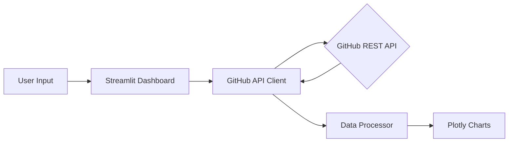

# 📊 GitHub Intelligence Dashboard

A production-ready API integration tool that consumes the GitHub REST API to perform deep-dives into developer profiles, repository health, and technical breadth.

## 🎯 Project Objective
The goal of this project is to demonstrate **Senior-Level API Integration** patterns. It goes beyond simple `GET` requests by implementing:
- **Resilient Networking**: Handling rate limits (403 Forbidden) and unexpected timeouts.
- **Data Transformation**: Normalizing nested JSON payloads into analytical DataFrames.
- **Interactive Visualization**: Translating raw metrics into "Project Health" scores and visual trends.

## 🚀 Features
- **Profile Summary**: Quick view of global stats (Followers, Gists, Repo counts).
- **Language Composition**: Aggregated analysis of code volume (in bytes) across top repositories.
- **Project Health Engine**: A custom deterministic scoring model that evaluates repo maturity based on stars, maintenance frequency, and documentation.
- **Rate Limit Resilience**: Built-in exponential backoff logic to ensure continuous operation.

## 🏗️ System Architecture

## 🛠️ Technical Stack
- **Python 3.12+**: Core logic and automation.
- **Requests & Sessions**: Efficient HTTP connection management.
- **Pandas**: High-performance data manipulation and aggregation.
- **Plotly**: interactive, publication-quality visualizations.
- **Streamlit**: Web interface for real-time analytics.

## ⚙️ Setup Instructions
1. **Clone the repo**
2. **Install dependencies**: `pip install -r requirements.txt`
3. **Set up Environment**: Copy `.env.example` to `.env`. (Optional: Add GITHUB_TOKEN to bypass rate limits).
4. **Run the App**: `streamlit run app.py`

---
*Created as part of the 30-Day Recruiter Attraction Challenge | Day 13*
