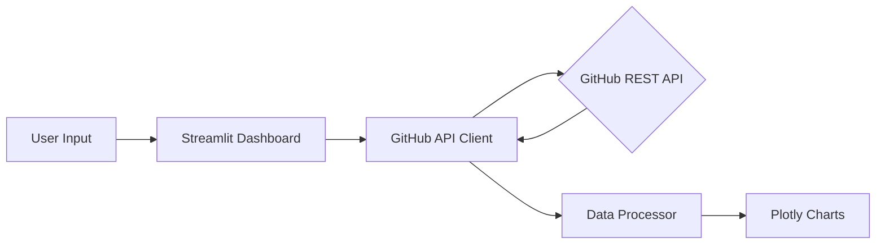

# 📊 GitHub Intelligence Dashboard

A production-ready API integration tool that consumes the GitHub REST API to perform deep-dives into developer profiles, repository health, and technical breadth.

## 🎯 Project Objective
The goal of this project is to demonstrate **Senior-Level API Integration** patterns. It goes beyond simple `GET` requests by implementing:
- **Resilient Networking**: Handling rate limits (403 Forbidden) and unexpected timeouts.
- **Data Transformation**: Normalizing nested JSON payloads into analytical DataFrames.
- **Interactive Visualization**: Translating raw metrics into "Project Health" scores and visual trends.

## 🚀 Features
- **Profile Summary**: Quick view of global stats (Followers, Gists, Repo counts).
- **Language Composition**: Aggregated analysis of code volume (in bytes) across top repositories.
- **Project Health Engine**: A custom deterministic scoring model that evaluates repo maturity based on stars, maintenance frequency, and documentation.
- **Rate Limit Resilience**: Built-in exponential backoff logic to ensure continuous operation.

## 🧠 System Logic: How it Works

The application is architected to be more than just a data-fetcher; it's a **resilient data integration engine**.

### 1. The Resilience Layer (`api_client.py`)
- **Connection Pooling**: Uses `requests.Session` to reuse TCP connections, reducing overhead.
- **Header Injection**: Automatically injects GitHub PATs (if present) and specific `vnd.github.v3+json` headers for API consistency.
- **Smart Rate Limiting**: Instead of crashing on a 403 Forbidden error, the client parses the `X-RateLimit-Reset` header, calculates the wait time, and suspends execution until the limit resets.

### 2. The Intelligence Engine (`processor.py`)
- **Data Normalization**: Converts raw, deeply nested JSON lists into structured Pandas DataFrames.
- **Health Scoring Algorithm**: 
    - `+20` if repo has a description.
    - `+30` if updated within the last 30 days.
    - `+20` if a valid open-source license is detected.
    - `Poplarity Bonus`: Up to 30 points based on Star count.

---

## 🛠️ Step-by-Step implementation Guide

I built this project in four distinct phases to ensure isolation of concerns:

### Phase 1: The Resilient Backbone
I started by building an API client that could handle "Real World" problems. I implemented **Exponential Backoff** and **Rate Limit Awareness** first, ensuring the foundation was unbreakable before even thinking about the UI.

### Phase 2: Data Modeling & Processing
Once I could reliably fetch data, I wrote the transformation logic. I focused on translating raw API responses into meaningful metrics, like "Language Concentration" and "Project Maturity," using **Pandas** for high-speed aggregation.

### Phase 3: Interactive Dashboarding
I used **Streamlit** to build the presentation layer. I designed the layout to lead with "North Star" metrics (Followers, Gist counts) before diving into complex Plotly visualizations.

### Phase 4: Production Polish
Finally, I implemented `.env` security, comprehensive logging, and an exhaustive `README` to ensure the project is ready for professional review.

---

## 🏗️ System Architecture

## 🛠️ Technical Stack
- **Python 3.12+**: Core logic and automation.
- **Requests & Sessions**: Efficient HTTP connection management.
- **Pandas**: High-performance data manipulation and aggregation.
- **Plotly**: interactive, publication-quality visualizations.
- **Streamlit**: Web interface for real-time analytics.

## ⚙️ Setup Instructions
1. **Clone the repo**
2. **Install dependencies**: `pip install -r requirements.txt`
3. **Set up Environment**: Copy `.env.example` to `.env`. (Optional: Add GITHUB_TOKEN to bypass rate limits).
4. **Run the App**: `streamlit run app.py`

---
*Created as part of the 30-Day Recruiter Attraction Challenge | Day 13*
